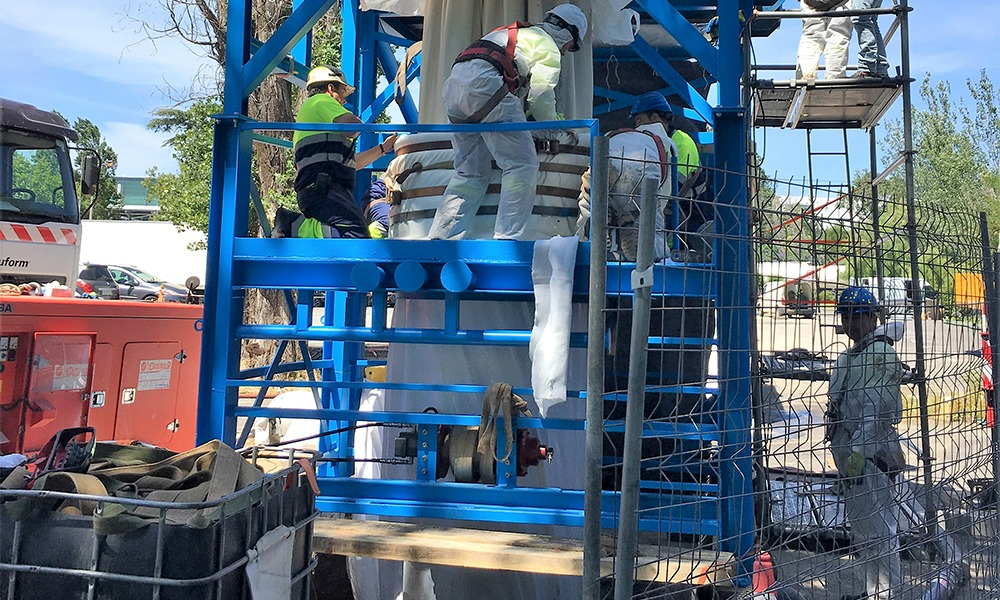

### A empreitada decorreu entre 2 a 5 de junho de 2017, em plena 2ª circular, em Lisboa.

A Insidepipe, empresa de reabilitação de condutas sem abertura de vala, situada no distrito de Aveiro, efetuou a reabilitação de um coletor, com diâmetro nominal de 1600mm, que pertence à ANA Aeroportos de Portugal e que faz a ligação da rede de saneamento de águas residuais e pluviais do Aeroporto Humberto Delgado à rede pública, entre a saída para a Avenida de Berlim e o Bairro da Encarnação.

O coletor alvo da reabilitação trata-se de uma conduta com cerca de 44ml, em betão, que apresentava fissuração e erosão ao longo de todo o troço, sendo que esta patologia colocava em risco a conduta a nível estrutural. Dada a localização, sob a 2ª Circular, a única forma viável de reabilitação passava pelo recurso a soluções sem abertura de vala, ou seja, as tecnologias No Dig. Neste caso concreto a solução técnica mais indicada foi o CIPP Cured in Place Pipe, dada a sua localização, diâmetro e profundidade entre os 12 e os 16 metros.

O CIPP Cured in Place Pipe consiste no encamisamento da tubagem degradada com uma manga impregnada em resina, introduzida pelas caixas de visita e que após a cura, torna-se numa estrutura autoportante independente. Resumidamente, é construir um tubo novo dentro de um já existente e que apresenta patologias graves. O tubo novo apresenta uma durabilidade de 50 anos.

A operação foi executada em quatro dias, o que levou ao corte da faixa da esquerda da 2ª Circular na zona da intervenção. Na obra estiveram envolvidas 20 pessoas, além de vários meios, para levar a cabo as operações de desvio de caudal e de instalação e cura da manga.

A reabilitação pelo método CIPP apresenta-se como uma solução única para renovação de condutas de drenagem de águas residuais e pluviais e de abastecimento de água, onde o impacto na sociedade é praticamente nulo, dada a eliminação de todos os incómodos inerentes à reconstrução tradicional com recurso à abertura de vala, bem como a economia de tempo, com prazos de execução mais curtos, sendo uma solução ecológica e que permite prolongar a vida dos sistemas.

